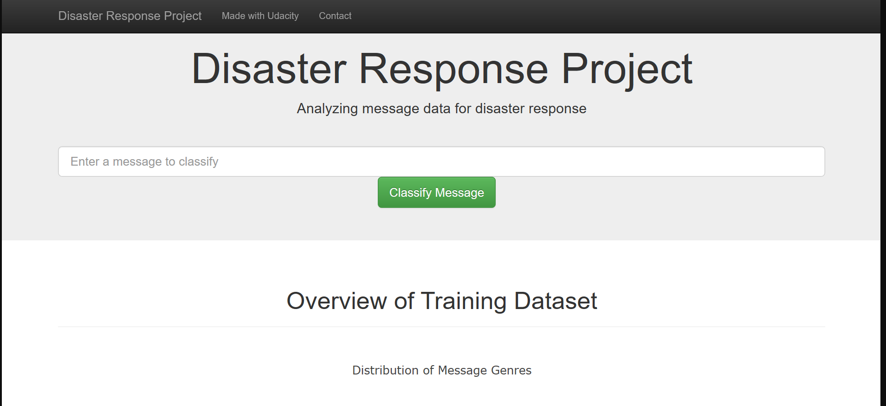

# Disaster Response Pipeline Project

## Required libraries
    nltk 
    numpy 
    pandas 
    scikit-learn
    sqlalchemy 
    
## Project Components:
There are three components of this project:

### 1. ETL Pipeline:
File data/process_data.py contains data cleaning pipeline that:

Loads the messages and categories dataset
Merges the two datasets
Cleans the data
Stores it in a SQLite database

### 2. ML Pipeline:
File models/train_classifier.py contains machine learning pipeline that:

Loads data from the SQLite database
Splits the data into training and testing sets
Builds a text processing and machine learning pipeline
Trains and tunes a model using GridSearchCV
Outputs result on the test set
Exports the final model as a pickle file

### 3. Flask Web App:
Flask Web App We will be taking the user message and classify them into 36 categories. There are some beautiful visualization of the data as well

## Description:
#### The Project is divided in the following Sections:

1. Data Processing, ETL Pipeline to extract data from source, clean data and save them in a proper databse structure
2. Machine Learning Pipeline to train a model able to classify text message in categories
3. Web App to show model results in real time.

## Motivation:
This project will include a web app where an emergency worker can input a new message and get classification results in several categories. The web app will also display visualizations of the data.

## Important Files:
data/process_data.py: The ETL pipeline used to process data in preparation for model building.
models/train_classifier.py: The Machine Learning pipeline used to fit, tune, evaluate, and export the model to a Python pickle (pickle is not uploaded to the repo due to size constraints.).
app/templates/*.html: HTML templates for the web app.
run.py: Start the Python server for the web app and prepare visualizations.

### Instructions:
1. Run the following commands in the project's root directory to set up your database and model.

    - To run ETL pipeline that cleans data and stores in database
        `python data/process_data.py data/disaster_messages.csv data/disaster_categories.csv data/DisasterResponse.db`
    - To run ML pipeline that trains classifier and saves
        `python models/train_classifier.py data/DisasterResponse.db models/classifier.pkl`

2. Run the following command in the app's directory to run your web app.
    `python run.py`

3. Go to http://0.0.0.0:3001/
